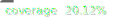

# MQP Dashboard Frontend

[](https://github.com/Munich-Quantum-Software-Stack/MQP-Dashboard-Frontend/actions/workflows/ci.yml)


This is the repository for MQP Dashboard Frontend MQSS Component, developed in React.

## 🎉 Getting started

To get started in development mode run

```sh
npm start
```

This will install all dependencies and will make available the dashboard at [http://localhost:3000](http://localhost:3000)

## 🚀 Deployment

MQP Dashboard Frontend can be deployed in three configurations:

- test: `npm run build:test`
- stage: `npm run build:stage`
- production: `npm run build`

Deployment scripts are provided to ease this action in a non-development environment.

## 🤝 Contributing

Thank you for your interest in contributing to our project!

Please refer to the [CONTRIBUTING](./CONTRIBUTING.md) guidelines.
